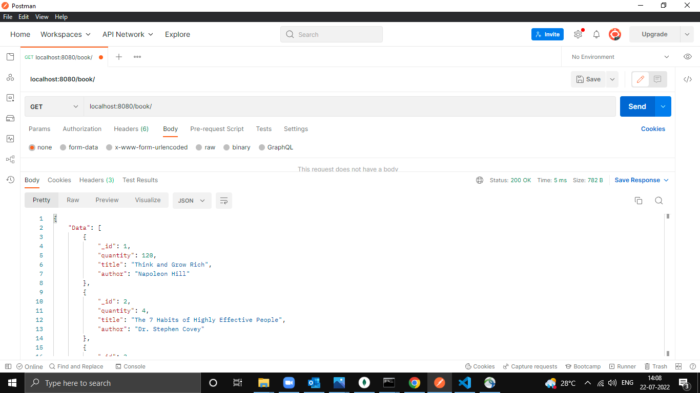
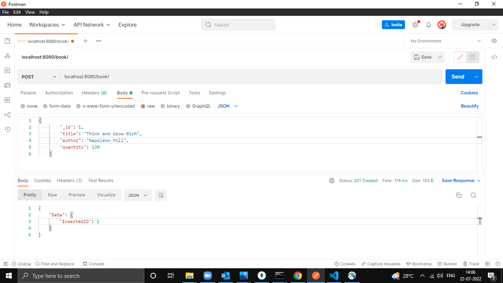
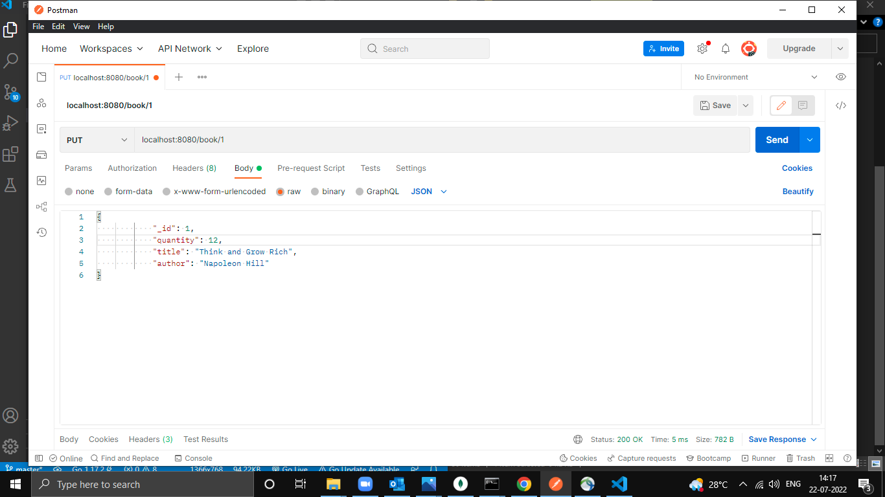
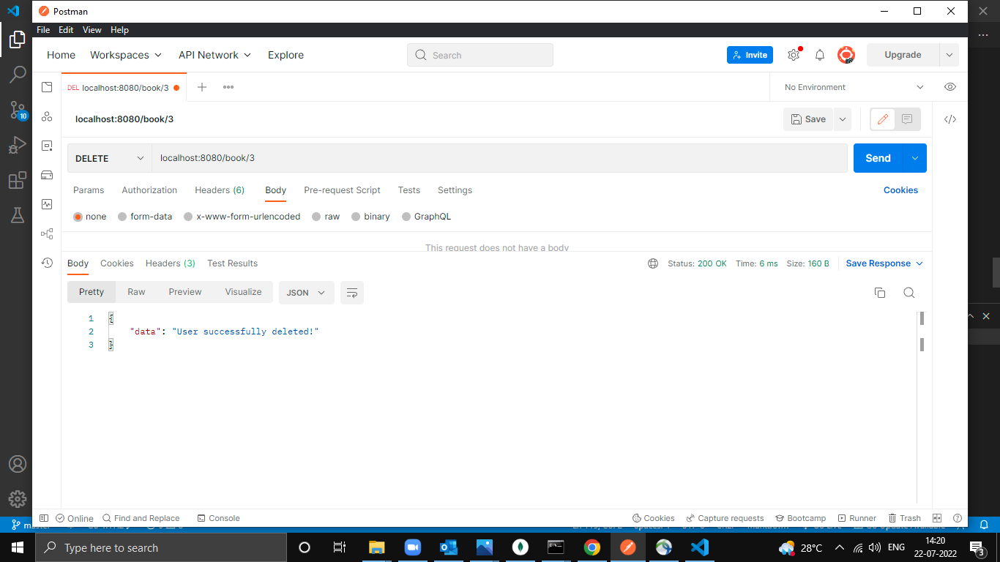

# CURD API WITH MONGODB USING GIN_GONIC
## Description

This is a API built using HTTP. This application is used to perform curd operation on Books_collection in database.
* Go, also known as Golang, is an open-source, compiled, and statically typed programming language designed by Google. It is built to be simple, high-performing, readable, and efficient.

* MongoDB is an open source NoSQL database management program. NoSQL is used as an alternative to traditional relational databases. NoSQL databases are quite useful for working with large sets of distributed data. MongoDB is a tool that can manage document-oriented information, store or retrieve information

----

## Pre-requisites
 Install Golang
 * [Installation for Windows](https://go.dev/doc/install) 
 * [Installation for Linux](https://golangdocs.com/install-go-linux)

 Install Gin_Gonic
 
 * [Installation Gin](https://gin-gonic.com/docs/)
 
 Install MongoDB
 
 * [Installation Guide for Mongodb](https://www.mongodb.com/docs/manual/installation/)


 ---
 ## Getting Started

 1. Clone the repository using:
 ```
 git clone https://github.com/code-moro/Curd-Api-Gin_Gonic.git
 ```
 2. Install Gin
 ```
 go get -u github.com/gin-gonic/gin
 ```
 3. Start Server
```
 go run .\main.go
 localhost:8080/
```
 

---
# API Endpoints

## 1.Get Request 

### API EndPoint : /book/
 


### Output

```
{
    "Data": [
        {
            "_id": 1,
            "quantity": 120,
            "title": "Think and Grow Rich",
            "author": "Napoleon Hill"
        },
        {
            "_id": 2,
            "quantity": 4,
            "title": "The 7 Habits of Highly Effective People",
            "author": "Dr. Stephen Covey"
        },
        {
            "_id": 3,
            "quantity": 10,
            "title": "Man’s Search for Meaning",
            "author": "Viktor Frankl"
        },
        {
            "_id": 4,
            "quantity": 5,
            "title": "The Alchemistg",
            "author": "Paulo Coelho"
        }
    ]
}
```
---

## 2.Post Request

### API EndPoint : /book/



#### Output
```
{
    "Data": {
        "InsertedID": 1
    }
}
```

---
## 3.Update Request

### API EndPoint : /book/:id



#### Output
```
{
    "_id": 1,
    "quantity": 12,
    "title": "Think and Grow Rich",
    "author": "Napoleon Hill"
}
```

---
## 4. Delete Request

### API EndPoint : /book/:id



#### Output
```
{
    "data": "User successfully deleted!"
}
```
 ----